# 🚀 LokerIn: AI-Powered Job Matching Platform

**LokerIn** is a next-generation job portal backend that replaces outdated "keyword search" with **Semantic AI Matching**. It uses vector embeddings to understand the *meaning* behind a resume, allowing candidates to find jobs based on skills and context, not just matching words.

## 🏗️ System Architecture

This system uses a **Retrieval-Augmented Generation (RAG)** approach to match candidates with jobs.

```mermaid
graph TD
    User["User (Web/Mobile)"] -->|HTTP Request| API["FastAPI Gateway"]

    subgraph "LokerIn Backend Container"
        API --> Auth["🔐 Auth Service (JWT)"]
        API --> Router["🚦 API Routers"]
        
        Router -->|1. Upload PDF| Parser["📄 Resume Parser"]
        Parser -->|2. Extract Text| AI["🧠 AI Engine (SentenceTransformer)"]
        
        Router -->|3. Search Query| AI
        AI -->|4. Generate Embedding| Vector["🔢 384-Dim Vector"]
    end

    subgraph "Database Container"
        Vector -->|5. Cosine Similarity Search| DB[("🐘 PostgreSQL + pgvector")]
        DB -->|6. Ranked Results| API
    end
```

## ✨ Key Features
### 🧠 AI & Vector Search Engine
* **Semantic Resume Matching**: Uses *Cosine Similarity* to match candidates to jobs based on *meaning* (e.g., matching "React" skills to "Frontend" jobs), not just keywords.
* **Automated Vectorization**: Automatically generates 384-dimensional vector embeddings (`all-MiniLM-L6-v2`) whenever a job is posted or updated.
* **Hybrid Search Architecture**: Combines traditional SQL filters (Location, Salary) with AI-powered semantic search for high-precision results.
* **Dynamic Re-Embedding**: Smart triggers that detect text changes in job descriptions and instantly regenerate vector embeddings to keep search accurate.

## ⚙️ Backend Engineering
* **Pagination**: Implemented `Offset/Limit` pagination with metadata (total items, total pages) to handle datasets efficiently.
* **Filtering Logic**: Features a Hybrid filter allowing complex boolean logic (e.g., "*Show jobs in Jakarta OR any Remote job*").
* **Database Optimization**: Uses SQLAlchemy's `selectinload` for Eager Loading to prevent N+1 query performance issues when fetching related data.
* **Asynchronous I/O**: Built fully on `Async/Await` architecture with `AsyncPG` for non-blocking database operations, ensuring high concurrency.

## 🛡️ Security & Access Control
* **Role-Based Access Control (RBAC)**: Strict permission layering separating `Seekers`, `Recruiters`, and `Admins`.
* **Ownership Verification**: Middleware-level checks ensure Recruiters can only modify or view applicants for jobs they actually own.
* **Secure Authentication**: JWT (JSON Web Token) implementation for stateless, secure API access.

## 🛠️ Tech Stack
* **Backend**: FastAPI (Python 3.12)
* **Database**: PostgreSQL 16 with `pgvector` extension
* **AI Model**: `all-MiniLM-L6-v2` (HuggingFace SentenceTransformers)
* **ORM**: SQLAlchemy (Async/Await)
* **Infrastructur**e: Docker & Docker Compose

