# 🚀 LokerIn: AI-Powered Job Matching Platform

**LokerIn** is a next-generation job portal backend that replaces outdated "keyword search" with **Semantic AI Matching**. It uses vector embeddings to understand the *meaning* behind a resume, allowing candidates to find jobs based on skills and context, not just matching words.


## 🏗️ System Architecture

This system uses a **Retrieval-Augmented Generation (RAG)** approach to match candidates with jobs.

```mermaid
graph TD
    User["User (Web/Mobile)"] -->|HTTP Request| API["FastAPI Gateway"]

    subgraph "LokerIn Backend Container"
        API --> Auth["🔐 Auth Service (JWT)"]
        API --> Router["🚦 API Routers"]
        
        Router -->|1. Upload PDF| Parser["📄 Resume Parser"]
        Parser -->|2. Extract Text| AI["🧠 AI Engine (SentenceTransformer)"]
        
        Router -->|3. Search Query| AI
        AI -->|4. Generate Embedding| Vector["🔢 384-Dim Vector"]
    end

    subgraph "Database Container"
        Vector -->|5. Cosine Similarity Search| DB[("🐘 PostgreSQL + pgvector")]
        DB -->|6. Ranked Results| API
    end
```



## ✨ Key Features
### 🧠 AI & Vector Search Engine
* **Semantic Resume Matching**: Uses *Cosine Similarity* to match candidates to jobs based on *meaning* (e.g., matching "React" skills to "Frontend" jobs), not just keywords.
* **Automated Vectorization**: Automatically generates 384-dimensional vector embeddings (`all-MiniLM-L6-v2`) whenever a job is posted or updated.
* **Hybrid Search Architecture**: Combines traditional SQL filters (Location, Salary) with AI-powered semantic search for high-precision results.
* **Dynamic Re-Embedding**: Smart triggers that detect text changes in job descriptions and instantly regenerate vector embeddings to keep search accurate.

### ⚙️ Backend Engineering
* **Pagination**: Implemented `Offset/Limit` pagination with metadata (total items, total pages) to handle datasets efficiently.
* **Filtering Logic**: Features a Hybrid filter allowing complex boolean logic (e.g., "*Show jobs in Jakarta OR any Remote job*").
* **Database Optimization**: Uses SQLAlchemy's `selectinload` for Eager Loading to prevent N+1 query performance issues when fetching related data.
* **Asynchronous I/O**: Built fully on `Async/Await` architecture with `AsyncPG` for non-blocking database operations, ensuring high concurrency.

### 🛡️ Security & Access Control
* **Role-Based Access Control (RBAC)**: Strict permission layering separating `Seekers`, `Recruiters`, and `Admins`.
* **Ownership Verification**: Middleware-level checks ensure Recruiters can only modify or view applicants for jobs they actually own.
* **Secure Authentication**: JWT (JSON Web Token) implementation for stateless, secure API access.

### 🛠️ Tech Stack
* **Backend**: FastAPI (Python 3.12)
* **Database**: PostgreSQL 16 with `pgvector` extension
* **AI Model**: `all-MiniLM-L6-v2` (HuggingFace SentenceTransformers)
* **ORM**: SQLAlchemy (Async/Await)
* **Infrastructur**e: Docker & Docker Compose

## 🚀 How to Run
**Option 1: Docker (Recommended)**
The easiest way to run the full stack (App + DB).
```bash
# 1. Clone the repository
git clone [https://github.com/yourusername/lokerin-backend.git](https://github.com/yourusername/lokerin-backend.git)
cd lokerin-backend

# 2. Create .env file
cp .env.example .env

# 3. Build and Run
docker-compose up --build -d

# 4. Access the API
# Go to http://localhost:8000/docs
```

**Option 2: Local Python Dev**
If you want to run the app manually without Docker.
```bash
# 1. Create Virtual Env
python -m venv .venv
source .venv/bin/activate  # Windows: .venv\Scripts\activate

# 2. Install Dependencies
pip install -r requirements.txt

# 3. Setup Database
# You must have PostgreSQL running locally with pgvector extension enabled!

# 4. Run Server
uvicorn main:app --reload
```

## 🧪 Testing the AI (Demo Flow)
1. **Register** as a User (Seeker).
2. **Upload CV**: `POST /api/v1/users/profile` (Upload a PDF).
3. **Find Matches**: `GET /api/v1/jobs/match`.
4. **Result**: The API returns jobs ranked by compatibility score (e.g., `92% Match`).

## ⚙️ Environment Variables
Create a `.env` file in the root directory:
```toml
# --- SECURITY ---
SECRET_KEY=change_this_to_a_secure_random_key_abc123
ALGORITHM=HS256
ACCESS_TOKEN_EXPIRE_MINUTES=30

# --- DATABASE ---
POSTGRES_USER=lokerin
POSTGRES_PASSWORD=change_me
POSTGRES_DB=lokerin_db
DB_HOST=db
DB_PORT=5432
```

## 📂 Project Structure
```text
├── 📂 routers/          # API Endpoints (Auth, Jobs, Users)
├── 📂 services/         # Business Logic (AI, PDF Parsing)
├── 📂 models/           # Database Schemas (SQLAlchemy)
├── 📂 schemas/          # Pydantic Data Models
├── config.py           # Environment Configuration
├── main.py             # App Entrypoint
├── Dockerfile          # Container Definition
└── docker-compose.yml  # Orchestration
```
